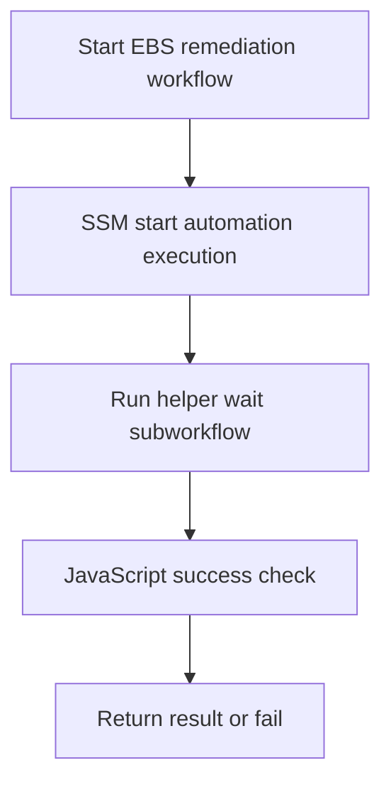

# AWS EBS Remediation and Maintenance Subworkflows

⚠️ **Staging folder**: This folder contains EBS-focused AWS remediation templates for common enterprise outage and maintenance scenarios.

All remediation subworkflows in this folder follow a strict non-fire-and-forget pattern:

1. Start AWS SSM Automation runbook using Dynatrace AWS action
2. Wait for execution completion using helper subworkflow
3. Validate SUCCESS and fail on non-success status

---

## 📦 Included Workflows

- `subworkflow-aws-wait-for-systems-manager-document-execution.workflow.json` (helper dependency)
- `subworkflow-aws-remediate-ebs-*.workflow.json` (50 remediation + maintenance subworkflows)

---

## 🧩 Architecture Pattern



---

## ⚙️ Common Inputs

| Input | Required | Description |
|---|---|---|
| `primaryResourceId` | ✅ | Primary AWS resource identifier |
| `awsregion` | ✅ | AWS region for remediation |
| `dynatraceawsconnection` | ✅ | Dynatrace AWS OIDC connection |
| `AutomationAssumeRolearn` | ⬜ | Optional automation assume role ARN |
| `volumeId` | ⬜ | EBS volume id for volume operations |
| `instanceId` | ⬜ | EC2 instance id for host-level operations |
| `snapshotId` | ⬜ | Snapshot id for backup/restore operations |
| `targetRegion` | ⬜ | DR/failover destination region |

---

## 🚀 Setup Steps

1. Import and deploy `subworkflow-aws-wait-for-systems-manager-document-execution.workflow.json`.
2. Copy the deployed workflow id for **subworkflow - aws wait for systems manager document execution**.
3. Replace helper workflow-id placeholder in remediation files:

```bash
WAIT_ID="<deployed-wait-workflow-id>"
for f in ebs/subworkflow-aws-remediate-ebs-*.workflow.json; do
  sed -i "s/c0000000-0000-4000-c000-000000000000/$WAIT_ID/g" "$f"
done
```

4. Import remediation subworkflows.

---

## 📚 Catalog (50 Subworkflows)

| File | Use Case | SSM Runbook |
|---|---|---|
| `subworkflow-aws-remediate-ebs-increase-ebs-volume-size.workflow.json` | Increase EBS volume size to recover from disk saturation outages. | `AWS-ExtendEbsVolume` |
| `subworkflow-aws-remediate-ebs-extend-ebs-volume-and-filesystem.workflow.json` | Extend EBS volume and filesystem online to restore service capacity. | `AWS-ExtendEbsVolume` |
| `subworkflow-aws-remediate-ebs-recover-impaired-ebs-volume.workflow.json` | Run recovery automation for an impaired EBS volume. | `AWSSupport-RecoverImpairedEbsVolume` |
| `subworkflow-aws-remediate-ebs-reattach-ebs-volume-to-instance.workflow.json` | Detach and reattach EBS volume to recover from attachment drift. | `AWSSupport-ReattachEbsVolume` |
| `subworkflow-aws-remediate-ebs-detach-stale-ebs-attachment.workflow.json` | Clean up stale attachment state blocking mount operations. | `AWSSupport-DetachStaleEbsAttachment` |
| `subworkflow-aws-remediate-ebs-force-mount-ebs-volume.workflow.json` | Repair and remount EBS volume when filesystem mount fails. | `AWSSupport-CheckAndMountEbsVolume` |
| `subworkflow-aws-remediate-ebs-fix-fstab-entry-for-ebs.workflow.json` | Correct fstab mapping to restore automatic EBS mounts after reboot. | `AWSSupport-FixLinuxFstabForEbs` |
| `subworkflow-aws-remediate-ebs-restart-instance-after-ebs-failure.workflow.json` | Restart impacted EC2 host after storage path recovery. | `AWS-RestartEC2Instance` |
| `subworkflow-aws-remediate-ebs-replace-unhealthy-ebs-volume.workflow.json` | Replace failing EBS volume with a fresh restored volume. | `AWSSupport-ReplaceUnhealthyEbsVolume` |
| `subworkflow-aws-remediate-ebs-migrate-ebs-volume-to-gp3.workflow.json` | Convert overloaded gp2 volume to gp3 for stable baseline performance. | `AWSSupport-MigrateEbsVolumeToGp3` |
| `subworkflow-aws-remediate-ebs-increase-ebs-iops.workflow.json` | Increase EBS provisioned IOPS to remediate storage latency spikes. | `AWS-ModifyEbsVolume` |
| `subworkflow-aws-remediate-ebs-increase-ebs-throughput.workflow.json` | Increase EBS throughput to recover from sustained write bottlenecks. | `AWS-ModifyEbsVolume` |
| `subworkflow-aws-remediate-ebs-change-ebs-volume-type.workflow.json` | Switch volume type to match workload profile and reduce outage risk. | `AWS-ModifyEbsVolume` |
| `subworkflow-aws-remediate-ebs-expand-io2-ebs-volume.workflow.json` | Scale io2 volume capacity for mission-critical high IOPS workloads. | `AWS-ModifyEbsVolume` |
| `subworkflow-aws-remediate-ebs-enable-ebs-fast-snapshot-restore.workflow.json` | Enable FSR on critical snapshots to speed up failover recovery. | `AWS-EnableFastSnapshotRestore` |
| `subworkflow-aws-remediate-ebs-disable-ebs-fast-snapshot-restore.workflow.json` | Disable FSR to reduce cost after incident stabilization. | `AWS-DisableFastSnapshotRestore` |
| `subworkflow-aws-remediate-ebs-create-on-demand-ebs-snapshot.workflow.json` | Create immediate snapshot backup before risky remediation changes. | `AWS-CreateSnapshot` |
| `subworkflow-aws-remediate-ebs-create-consistent-ebs-snapshot-set.workflow.json` | Create coordinated snapshot set for multi-volume workload recovery. | `AWSSupport-CreateMultiVolumeSnapshot` |
| `subworkflow-aws-remediate-ebs-copy-ebs-snapshot-cross-region.workflow.json` | Replicate snapshot to failover region for disaster recovery readiness. | `AWS-CopySnapshot` |
| `subworkflow-aws-remediate-ebs-share-ebs-snapshot-with-dr-account.workflow.json` | Share snapshot with disaster recovery account for cross-account restore. | `AWSSupport-ShareEbsSnapshot` |
| `subworkflow-aws-remediate-ebs-tag-ebs-snapshots-for-retention.workflow.json` | Tag backup snapshots to enforce lifecycle retention policy. | `AWSSupport-TagEbsSnapshots` |
| `subworkflow-aws-remediate-ebs-delete-expired-ebs-snapshots.workflow.json` | Delete old snapshots to prevent backup sprawl and cost explosions. | `AWS-DeleteSnapshot` |
| `subworkflow-aws-remediate-ebs-enable-ebs-snapshot-lifecycle-policy.workflow.json` | Enable DLM policy for automated recurring EBS backups. | `AWSSupport-EnableEbsDlmPolicy` |
| `subworkflow-aws-remediate-ebs-repair-broken-ebs-snapshot-policy.workflow.json` | Repair disabled or failed EBS backup lifecycle policy. | `AWSSupport-RepairEbsDlmPolicy` |
| `subworkflow-aws-remediate-ebs-restore-ebs-volume-from-snapshot.workflow.json` | Restore production volume from known-good snapshot after corruption. | `AWS-RestoreEbsVolumeFromSnapshot` |
| `subworkflow-aws-remediate-ebs-warm-restored-ebs-volume.workflow.json` | Pre-warm restored EBS volume blocks to reduce post-recovery latency. | `AWSSupport-WarmEbsVolume` |
| `subworkflow-aws-remediate-ebs-validate-ebs-snapshot-recoverability.workflow.json` | Run restore validation for backup recoverability testing. | `AWSSupport-ValidateEbsSnapshotRecovery` |
| `subworkflow-aws-remediate-ebs-trigger-ebs-dr-failover.workflow.json` | Fail over storage workload to standby resources in DR region. | `AWSSupport-TriggerEbsDrFailover` |
| `subworkflow-aws-remediate-ebs-promote-dr-ebs-volume-primary.workflow.json` | Promote recovered standby volume to primary write target. | `AWSSupport-PromoteDrEbsVolume` |
| `subworkflow-aws-remediate-ebs-reverse-ebs-failover.workflow.json` | Fail back from DR to primary region after outage resolution. | `AWSSupport-ReverseEbsFailover` |
| `subworkflow-aws-remediate-ebs-sync-primary-to-dr-ebs-snapshots.workflow.json` | Synchronize latest snapshots to DR account and region. | `AWSSupport-SyncEbsSnapshotsToDr` |
| `subworkflow-aws-remediate-ebs-verify-ebs-failover-readiness.workflow.json` | Execute failover readiness checks for storage RTO/RPO controls. | `AWSSupport-VerifyEbsFailoverReadiness` |
| `subworkflow-aws-remediate-ebs-repair-ebs-csi-driver-on-eks.workflow.json` | Recover EBS CSI controller issues causing PVC mount failures. | `AWSSupport-TroubleshootEbsCsiDriversForEks` |
| `subworkflow-aws-remediate-ebs-restart-ebs-csi-controller.workflow.json` | Restart EBS CSI controller deployment to clear stale API sessions. | `AWSSupport-RestartEbsCsiController` |
| `subworkflow-aws-remediate-ebs-remediate-pvc-stuck-pending.workflow.json` | Fix PVC provisioning failures caused by storage class or quota issues. | `AWSSupport-RemediatePvcPendingEbs` |
| `subworkflow-aws-remediate-ebs-force-detach-ebs-from-stuck-node.workflow.json` | Force detach EBS from failed node to unblock workload reschedule. | `AWSSupport-ForceDetachEbsFromNode` |
| `subworkflow-aws-remediate-ebs-reencrypt-ebs-volume-with-kms.workflow.json` | Re-encrypt volume with approved KMS key after compliance incident. | `AWSSupport-ReencryptEbsVolume` |
| `subworkflow-aws-remediate-ebs-enable-ebs-encryption-by-default.workflow.json` | Enable account-level default encryption for all new EBS volumes. | `AWS-EnableEbsEncryptionByDefault` |
| `subworkflow-aws-remediate-ebs-rotate-ebs-kms-key-association.workflow.json` | Rotate KMS key mapping for encrypted EBS data at rest. | `AWSSupport-RotateEbsKmsKey` |
| `subworkflow-aws-remediate-ebs-audit-unencrypted-ebs-volumes.workflow.json` | Audit and report unencrypted EBS volumes for remediation targeting. | `AWSSupport-AuditUnencryptedEbsVolumes` |
| `subworkflow-aws-remediate-ebs-repair-linux-filesystem-on-ebs.workflow.json` | Run fsck repair on EBS-backed filesystem after unclean shutdown. | `AWSSupport-RepairLinuxFileSystemOnEbs` |
| `subworkflow-aws-remediate-ebs-repair-windows-ntfs-on-ebs.workflow.json` | Run chkdsk remediation on EBS-backed NTFS volume corruption. | `AWSSupport-RepairWindowsNtfsOnEbs` |
| `subworkflow-aws-remediate-ebs-reorganize-postgres-indexes-on-ebs.workflow.json` | Reindex PostgreSQL tables hosted on EBS-backed EC2 to recover performance. | `AWSSupport-RunPostgresReindexOnEc2` |
| `subworkflow-aws-remediate-ebs-reorganize-mysql-indexes-on-ebs.workflow.json` | Optimize and rebuild MySQL indexes on EBS-backed EC2 databases. | `AWSSupport-RunMysqlIndexOptimizeOnEc2` |
| `subworkflow-aws-remediate-ebs-reorganize-sqlserver-indexes-on-ebs.workflow.json` | Reorganize SQL Server indexes on EBS-backed EC2 to reduce I/O pressure. | `AWSSupport-RunSqlServerIndexMaintenanceOnEc2` |
| `subworkflow-aws-remediate-ebs-vacuum-postgres-on-ebs.workflow.json` | Run VACUUM ANALYZE to reclaim bloat on EBS-backed PostgreSQL. | `AWSSupport-RunPostgresVacuumOnEc2` |
| `subworkflow-aws-remediate-ebs-rebuild-fragmented-indexes-batch.workflow.json` | Run batched index rebuild maintenance to recover query latency. | `AWSSupport-RunDbIndexRebuildBatchOnEc2` |
| `subworkflow-aws-remediate-ebs-defragment-xfs-ebs-filesystem.workflow.json` | Defragment XFS filesystem to reduce fragmentation-related latency. | `AWSSupport-DefragmentXfsOnEbs` |
| `subworkflow-aws-remediate-ebs-cleanup-ebs-temp-files.workflow.json` | Clean temporary/log files to free blocked disk space quickly. | `AWS-RunPatchBaseline` |
| `subworkflow-aws-remediate-ebs-trim-unused-blocks-on-ebs.workflow.json` | Run fstrim maintenance to optimize SSD-backed EBS utilization. | `AWSSupport-RunFstrimOnEbs` |

---

## ✅ Validation Checklist

- ✅ 50 EBS remediation/maintenance subworkflows generated
- ✅ 1 helper wait subworkflow generated
- ✅ No `id` fields included
- ✅ All JSON files are valid
- ✅ Emoji guides included in helper and remediation workflows

---

## 🔎 Notes

- Runbooks prefixed with `AWSSupport-` are standard AWS Support Automation patterns in many environments.
- Some scenarios (for example specialized database index maintenance) may require custom SSM Automation documents in your account.
- All templates still keep the same wait-and-check control flow and can be adapted by only changing `DocumentName` and parameters.
