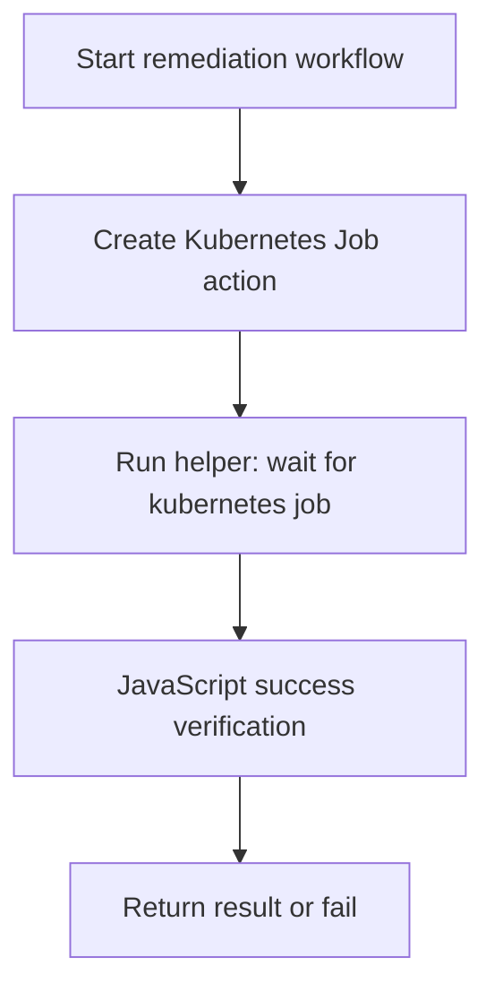

# Kubernetes Remediation Subworkflows (Dynatrace Kubernetes Connector)

⚠️ **Staging folder**: This folder contains Kubernetes remediation subworkflows generated as templates for common enterprise outage patterns.

All remediation subworkflows in this folder follow a strict non-fire-and-forget control flow:

1. Execute remediation action using Dynatrace Kubernetes connector
2. Wait for operation completion through helper subworkflow
3. Verify success and fail on unsuccessful completion

---

## 📦 Included Workflows

- `subworkflow-kubernetes-wait-for-job.workflow.json` (helper dependency)
- `subworkflow-kubernetes-remediate-*.workflow.json` (50 remediation subworkflows)

---

## 🧩 Architecture Pattern



---

## ⚙️ Common Inputs

| Input | Required | Description |
|---|---|---|
| `primaryResourceId` | ✅ | Primary resource identifier for correlation/audit |
| `clusterName` | ✅ | Kubernetes cluster context |
| `namespace` | ✅ | Namespace for remediation target |
| `targetName` | ✅ | Resource/workload name to remediate |
| `dynatracekubernetesconnection` | ✅ | Dynatrace Kubernetes connection |

Additional optional inputs are included in templates for node, manifest, registry, and scaling based remediations.

---

## 🚀 Setup Steps

1. Import and deploy `subworkflow-kubernetes-wait-for-job.workflow.json` first.
2. Copy the deployed workflow id for **subworkflow - kubernetes wait for job**.
3. Replace placeholder wait-id across remediation files:

```bash
WAIT_ID="<deployed-wait-workflow-id>"
for f in kubernetes/subworkflow-kubernetes-remediate-*.workflow.json; do
  sed -i "s/b0000000-0000-4000-b000-000000000000/$WAIT_ID/g" "$f"
done
```

4. Import remediation subworkflows.

---

## 📚 Catalog (50 Subworkflows)

| File | Use Case |
|---|---|
| `subworkflow-kubernetes-remediate-restart-deployment-rollout.workflow.json` | Restart a deployment when pods are stuck or unhealthy. |
| `subworkflow-kubernetes-remediate-restart-statefulset-rollout.workflow.json` | Restart a statefulset to recover hung stateful pods. |
| `subworkflow-kubernetes-remediate-delete-crashloop-pod.workflow.json` | Delete a crashing pod so it can be recreated cleanly. |
| `subworkflow-kubernetes-remediate-force-new-replicaset.workflow.json` | Patch deployment annotation to force a fresh rollout. |
| `subworkflow-kubernetes-remediate-scale-up-deployment.workflow.json` | Increase replicas during sudden traffic surges. |
| `subworkflow-kubernetes-remediate-scale-down-deployment.workflow.json` | Reduce replicas to stabilize overloaded nodes. |
| `subworkflow-kubernetes-remediate-resume-paused-deployment.workflow.json` | Resume a paused deployment rollout. |
| `subworkflow-kubernetes-remediate-undo-failed-deployment.workflow.json` | Rollback a failed deployment rollout. |
| `subworkflow-kubernetes-remediate-restart-daemonset-rollout.workflow.json` | Restart daemonset pods after node-level agent issues. |
| `subworkflow-kubernetes-remediate-delete-evicted-pods.workflow.json` | Remove evicted pods to free scheduler noise and retries. |
| `subworkflow-kubernetes-remediate-clear-imagepullbackoff-pods.workflow.json` | Delete pods with image pull failures after registry recovery. |
| `subworkflow-kubernetes-remediate-restart-failing-job.workflow.json` | Delete and recreate a failing batch job. |
| `subworkflow-kubernetes-remediate-unblock-pending-pods.workflow.json` | Delete pending pods that are stuck after capacity recovers. |
| `subworkflow-kubernetes-remediate-restart-coredns.workflow.json` | Restart CoreDNS to recover cluster DNS outages. |
| `subworkflow-kubernetes-remediate-restart-kube-proxy.workflow.json` | Restart kube-proxy daemonset for networking recovery. |
| `subworkflow-kubernetes-remediate-reload-ingress-controller.workflow.json` | Restart ingress controller to restore traffic routing. |
| `subworkflow-kubernetes-remediate-reconcile-hpa-target.workflow.json` | Reapply HPA spec after autoscaling drift. |
| `subworkflow-kubernetes-remediate-remove-failed-finalizers.workflow.json` | Patch stuck resources by removing broken finalizers. |
| `subworkflow-kubernetes-remediate-restart-metrics-server.workflow.json` | Restart metrics server to recover HPA/metrics outages. |
| `subworkflow-kubernetes-remediate-rollout-restart-api-gateway.workflow.json` | Restart API gateway workload after 5xx spikes. |
| `subworkflow-kubernetes-remediate-restart-worker-consumers.workflow.json` | Restart queue consumer workers after lag buildup. |
| `subworkflow-kubernetes-remediate-rotate-failed-sidecars.workflow.json` | Restart pods to recover sidecar injection failures. |
| `subworkflow-kubernetes-remediate-resync-configmap-volume.workflow.json` | Restart pods to pick up corrected ConfigMap values. |
| `subworkflow-kubernetes-remediate-resync-secret-volume.workflow.json` | Restart pods to pick up rotated Secret values. |
| `subworkflow-kubernetes-remediate-restart-webhook-deployment.workflow.json` | Restart admission webhook deployment on TLS issues. |
| `subworkflow-kubernetes-remediate-restart-operator-controller.workflow.json` | Restart operator controller to restore reconciliation loops. |
| `subworkflow-kubernetes-remediate-restart-cert-manager.workflow.json` | Restart cert-manager components after cert issuance failures. |
| `subworkflow-kubernetes-remediate-renew-cert-failed-pods.workflow.json` | Delete pods blocked by expired mounted certs. |
| `subworkflow-kubernetes-remediate-restart-istiod.workflow.json` | Restart Istiod control plane after mesh config failures. |
| `subworkflow-kubernetes-remediate-restart-istio-ingressgateway.workflow.json` | Restart ingress gateway after mTLS/routing failures. |
| `subworkflow-kubernetes-remediate-restart-node-local-dns.workflow.json` | Restart node-local-dns daemonset for node DNS failures. |
| `subworkflow-kubernetes-remediate-drain-and-uncordon-node.workflow.json` | Drain a problematic node and return it to service. |
| `subworkflow-kubernetes-remediate-uncordon-node.workflow.json` | Uncordon a node stuck in scheduling disabled state. |
| `subworkflow-kubernetes-remediate-cordon-flapping-node.workflow.json` | Cordon unstable node to protect workloads. |
| `subworkflow-kubernetes-remediate-restart-local-path-provisioner.workflow.json` | Restart storage provisioner during PVC binding failures. |
| `subworkflow-kubernetes-remediate-force-delete-terminating-pod.workflow.json` | Force-remove pods stuck in Terminating state. |
| `subworkflow-kubernetes-remediate-remove-pod-disruption-block.workflow.json` | Scale up replicas to unblock PDB during upgrades. |
| `subworkflow-kubernetes-remediate-restart-fluentbit.workflow.json` | Restart log agent daemonset after log shipping outage. |
| `subworkflow-kubernetes-remediate-restart-otel-collector.workflow.json` | Restart collector deployment after telemetry pipeline errors. |
| `subworkflow-kubernetes-remediate-restart-eventing-controller.workflow.json` | Restart eventing controller after trigger processing stalls. |
| `subworkflow-kubernetes-remediate-restart-gitops-controller.workflow.json` | Restart GitOps controller after reconciliation deadlock. |
| `subworkflow-kubernetes-remediate-resume-argo-rollouts.workflow.json` | Resume paused Argo rollout after manual hold. |
| `subworkflow-kubernetes-remediate-abort-argo-rollout.workflow.json` | Abort unstable Argo rollout to stop blast radius. |
| `subworkflow-kubernetes-remediate-retry-failed-helm-release.workflow.json` | Retry failed Helm release upgrade/rollback. |
| `subworkflow-kubernetes-remediate-restart-api-server-proxy.workflow.json` | Restart API proxy component for control-plane API errors. |
| `subworkflow-kubernetes-remediate-reapply-network-policy.workflow.json` | Reapply network policy to recover denied traffic paths. |
| `subworkflow-kubernetes-remediate-recreate-service-endpoints.workflow.json` | Recreate service to repair missing endpoints object. |
| `subworkflow-kubernetes-remediate-restart-keda-operator.workflow.json` | Restart KEDA operator after scaling trigger failures. |
| `subworkflow-kubernetes-remediate-restart-external-dns.workflow.json` | Restart ExternalDNS after stale DNS record sync. |
| `subworkflow-kubernetes-remediate-restart-cert-sync-controller.workflow.json` | Restart cert sync controller after secret propagation delays. |

---

## ✅ Validation Checklist

- ✅ 50 remediation subworkflows generated
- ✅ 1 helper wait subworkflow generated
- ✅ No `id` fields included
- ✅ All JSON files valid (`jq empty`)
- ✅ Guide sections include emojis and explicit wait/check behavior

---

## 🔎 Notes

- These templates use Dynatrace Kubernetes connector action IDs:
  - `dynatrace.kubernetes.connector:kubernetes-batch-v1-create-namespaced-job`
  - `dynatrace.kubernetes.connector:kubernetes-batch-v1-read-namespaced-job-status`
- If your environment exposes action IDs with a different naming convention, adjust action names consistently across this folder.
